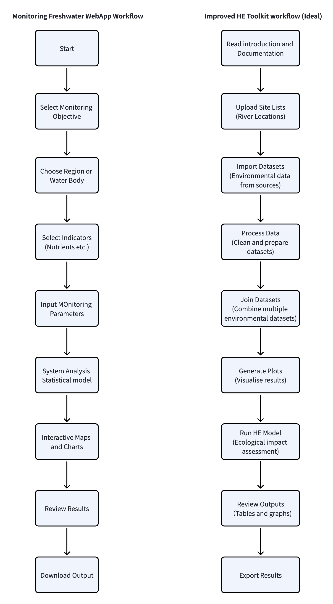

# 3.2 New Zealand Freshwater Monitoring and Improvement

https://www.monitoringfreshwater.co.nz/
https://www.monitoringfreshwater.co.nz/webapp#webapp-dash

# Related work

This website is also an environmental data analysis platform designed for non-programming users, and it presents its outputs in a dashboard format. Its main function is similar to the HE Toolkit: users import or select data, run analysis, and view the results through visualisations. Users need to specify a monitoring plan before reviewing the outputs, which makes its target users quite similar to those of the HE Toolkit.

One strength of this website is that the user workflow is very clear. After opening the site, users immediately see a button that takes them to the dashboard, and the website guides them through the next steps.

After clicking through, users are taken to three options representing rivers, lakes, and groundwater. This helps users decide what type of data or monitoring task they want to work with next. Once they enter one of these sections, they can directly select the data they want to search, query, and download.

Another useful feature is that after users make their selection, the website does not only provide data. It also helps users design a monitoring programme. Since HE Toolkit staff are also working on decision support, this idea could be useful for our own dashboard. For example, the HE Toolkit could embed AI assistance or examples that provide recommendations to users.

The website also has some weaknesses. First, non-coders may still be confused by specialist terms such as nitrogen, phosphorus, sediment, and monitoring indicators. There is still an entry barrier. I think this could be improved by adding sidebar explanations for these terms, so that first-time users can understand the meaning even when technical vocabulary is used. Second, the website contains a large amount of information, which may make it difficult for users to identify the key content at first. In the HE Toolkit website, we could selectively highlight the most important and currently relevant content to help users quickly find the main focus of the site.

# Workflow

# Target users

The main users of this website are environmental managers, such as staff from government agencies, councils, and environmental protection organisations. Their work includes designing river monitoring plans, assessing water quality changes, managing pollution risks, and supporting environmental policy development.

These users share several common characteristics:

1. They usually have an environmental science background.
2. They want to obtain analysis results quickly.
3. They care more about decision-making than model details.

The secondary users are environmental scientists and researchers. Compared with the primary users, they are more likely to be able to use R or Python. They can use this platform to select monitoring indicators, quickly compare different options, explore data, collect evidence, and support their own research.

Other possible users include environmental consulting companies, teachers, and students. Environmental consulting companies may want to obtain results quickly when conducting environmental impact assessments, and the website can export data that companies can present clearly to clients. Teachers can also use the platform for environmental science teaching, classroom case studies, and related educational activities.

The target users of this website are broadly similar to the main target users of the HE Toolkit. They focus more on results and are unlikely to use R. Therefore, the dashboard should emphasise:

1. Clear chart presentation.
2. Clear map content.
3. Final model outputs.
4. Easy-to-understand error messages.

Finally, if possible, the dashboard could provide decision support to help users answer basic questions. Embedded AI might be one way to achieve this.
