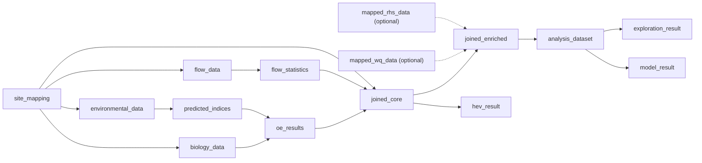

# Week 7 Architecture and Workflow State Specification

Owner: Bo Sun

Reviewer: Lin Zhu

Status: v1.0 baseline for implementation

## Scope

This specification freezes the Architecture/State work assigned to Bo for Week 7:

- five user goals and their paths through the existing five workflow stages;
- the dependency boundaries between core, enriched, and analysis datasets;
- the seven workflow states;
- stale propagation rules and checkpoint structure;
- a configuration skeleton that can be consumed by the Goal Selector and Stepper in a later iteration.

This is not a generic workflow engine and does not implement full runtime stale propagation. It does not change O:E, HEV, WQ/RHS import, local-file import, or modelling calculations.

## Client Decisions Reflected

1. WQ and RHS are optional supporting datasets joined after the biology-flow core join.
2. Missing WQ/RHS data must not block the biology-flow core workflow.
3. Filtering affects only the final analysis dataset; it does not mutate upstream O:E, flow statistics, `joined_core`, or `joined_enriched`.
4. `rhs_survey_id` is the standard RHS identifier. `rhs_site_id` must not be silently converted.
5. HDE is the preferred flow source; NRFA fallback must be visible in provenance.
6. Goal selection highlights the existing workflow path and must not create a second navigation system.

## Five Workflow Stages

| Order | Stage ID | User-facing stage | Responsibility |
|---|---|---|---|
| 1 | `input_mapping` | Input and mapping | Select a goal, provide site mapping, and choose local or remote sources. |
| 2 | `import_validate` | Import and validation | Validate schemas and import biology, environment, flow, and optional WQ/RHS data. |
| 3 | `process_core` | Core processing | Run RICT, calculate O:E, optionally impute flow, and calculate flow statistics. |
| 4 | `join_enrich` | Join and optional enrichment | Create `joined_core`, then optionally add WQ/RHS to create `joined_enriched`. |
| 5 | `explore_model_export` | Explore, filter, model and export | Explore data, create `analysis_dataset`, fit a selected model, and export outputs. |

The Goal Selector only highlights the required and optional steps in these stages. The dashboard's top-level navigation remains available at all times.

## Five Goal Paths

| Goal | Required inputs | Required path | Optional path | Final outputs |
|---|---|---|---|---|
| Validate and review input data | At least one supported dataset | Select goal -> upload/select source -> validate | Mapping, WQ and RHS preview | Validation checkpoint and data preview |
| Calculate biological O:E | Mapping, biology, environmental data | Validate -> import biology/environment -> RICT -> O:E | None | Expected indices and O:E results |
| Calculate flow statistics and HEV | Mapping, O:E, flow data | Validate/import -> flow statistics -> `joined_core` -> HEV | Flow imputation | Flow statistics, core join and HEV plot |
| Build a joined analysis dataset | Mapping, O:E, flow statistics | Core processing -> `joined_core` | WQ/RHS import and `joined_enriched` | Core dataset and optional enriched dataset |
| Explore, filter, model and export | `joined_core` or `joined_enriched` | Explore -> filter -> `analysis_dataset` -> model -> export | WQ/RHS enrichment and HEV | Analysis data, exclusion log, model result and exports |

The full machine-readable conditions are defined in `R/workflow_state_helpers.R` through `workflow_goal_config()` and `workflow_goal_matrix()`.

## Dataset Layers and Dependency Map



`joined_core` contains biology O:E plus flow statistics and is never dependent on WQ or RHS. `joined_enriched` is a separate derived layer that starts from `joined_core` and adds selected supporting data. `analysis_dataset` is a filtered copy used for exploration and modelling; filtering must never mutate either joined layer.

## Seven Workflow States

| State | Meaning | Output viewable? | May continue? |
|---|---|---:|---:|
| `not_ready` | Required prerequisites are missing. | No | No |
| `ready` | Prerequisites are satisfied and the action can run. | No | Yes |
| `running` | The action is currently running. | No | Wait/cancel only |
| `complete` | Output exists and matches current upstream inputs. | Yes | Yes |
| `warning` | Output or prerequisite is usable but needs attention. | Yes when present | Yes unless the checkpoint says otherwise |
| `error` | The current action failed. Independent branches remain usable. | No new output | No for this action |
| `stale` | Output is retained but was created from older inputs. | Yes | No downstream reuse until regenerated |

State precedence in the configuration skeleton is: `error` -> `running` -> `stale` -> `warning` -> `complete` -> `ready` -> `not_ready`.

## Stale Propagation Rules

| Change event | Outputs marked stale | Explicitly unchanged |
|---|---|---|
| Biology data changes | O:E, `joined_core`, `joined_enriched`, `analysis_dataset`, exploration, HEV and model | Existing environmental predictions until environmental inputs change |
| Environmental data changes | RICT predictions, O:E and all downstream core/enriched/analysis outputs | Imported biology and flow data |
| Flow data changes | Imputed flow, flow statistics, core/enriched/analysis outputs, exploration, HEV and model | O:E |
| WQ enrichment changes | `joined_enriched`, `analysis_dataset`, exploration and model | `joined_core`, O:E, flow statistics and HEV |
| RHS enrichment changes | `joined_enriched`, `analysis_dataset`, exploration and model | `joined_core`, O:E, flow statistics and HEV |
| Filtering changes | `analysis_dataset`, exploration and model | `joined_core` and `joined_enriched` |
| Exploration options change | Exploration output only | All datasets and model |
| Model variables change | `model_result` only | All datasets and exploration |
| Goal selection changes | No scientific output | Goal selection only changes highlighted guidance |

Stale outputs remain viewable with their provenance, but cannot be treated as current inputs to downstream actions. The user must rerun the action identified by the checkpoint.

## Checkpoint Contract

Every workflow checkpoint has the following fields:

```text
status
evidence_summary
affected_output
required_user_action
next_recommended_step
```

`new_workflow_checkpoint()` validates this contract. User-facing errors should state what failed, why it failed, accepted input, how to fix it, and what remains usable.

## UX and QA Review Notes

As UX/Workflow reviewer, Bo confirms that the frozen architecture requires the Stepper to show the current stage, required steps, warning/error/stale evidence, and next recommended action without replacing the existing navigation.

As QA/Reproducibility reviewer, Bo added executable tests for the five goals, five stages, seven states, checkpoint contract, and the four critical stale boundaries specified in the Week 7 plan. Data-pipeline contract defects found during review remain owned by the Data Pipeline role and are recorded in the implementation report rather than silently changed in this architecture PR.

## Acceptance Evidence

Run:

```powershell
Rscript --vanilla tests\test_workflow_state_helpers.R
```

The test proves:

- WQ/RHS changes do not stale `joined_core`;
- filtering does not stale either joined layer;
- model-variable changes stale only `model_result`;
- biology changes stale O:E, joins, exploration, HEV and model;
- the goal/stage/state configuration is internally consistent.
