# Week 9 Real UI Parity Validation

## Validation identity

| Field | Value |
|---|---|
| Validation date | `2026-07-29` |
| Application command | `Rscript -e 'shiny::runApp(".", host="127.0.0.1", port=4297, launch.browser=FALSE)'` |
| HEAD commit SHA | `7b200c118d2de7521604a2e0c22ef1cf96aacb1c` |
| Tested source state | HEAD plus the current uncommitted UI/workflow changes |
| Implementation diff SHA-256 | `80abaa681f61edc1619f89887558ca97367f51bb0a3d26e2f2c4837f55b50ad4` |

The screenshots are unmodified captures of the running Shiny application. This
manifest is the required annotation for each image: it records the commit SHA,
scenario, expected result, actual result, and validation decision without
overlaying text on the UI evidence.

Screenshots 01–07 record the pre-fix validation baseline. Screenshots 08–11
record the follow-up revalidation against the implementation diff above and
supersede the earlier failed/partial decisions for the affected scenarios.

## Scenario result

| Scenario | Expected | Actual result | Decision |
|---|---|---|---|
| Initial entry | Five Tasks and no second visible primary navigation | Five Task cards rendered. The only visible primary navigation was `Five-stage workflow`. | PASS |
| Select every Task | Configured Required/Optional/Not used path | All five rendered paths matched the frozen matrix exactly. | PASS |
| Start/Resume | Current artifact state selects the correct Stage | After a valid Local Flow result, selecting Task 2 opened Stage 2 rather than Stage 1. | PASS |
| Missing input | Untouched is `Not started`; an attempted dependent action is `Blocked` with a concrete next action | Before action, Flow statistics remained `Not started` with a calculate instruction. After clicking Calculate without Flow input, Stage 2 became `Blocked` and instructed the user to upload/import Flow data and retry. | PASS |
| Valid result | `complete` | A valid Local Flow upload rendered Stage 1 and `flow_input` as `Complete`, with source and history. | PASS |
| Usable result with risk | `warning` without blocking | A valid Local Flow upload with extra columns rendered `Warning`; the file remained usable and the ignored columns were named. | PASS |
| Upstream change | Only dependent results become `stale` | A long valid Local Flow source produced current Flow statistics. Replacing that source preserved the new usable Flow input and changed Stage 2 / Flow statistics from `Complete` to `Stale`, with a regenerate action. | PASS |
| Change Task | Preserve reusable completion artifacts | After Flow statistics completed, Change Task returned to the selector. Task 2 still listed `Processed flow, Flow statistics`, displayed `Review completed Task`, and resumed at Stage 2. | PASS |
| Flow-statistics exception | Recoverable `failed/blocked` with safe reason and next action | The short replacement source triggered the real calculation exception. Stage 2 became `Failed`, displayed a review/change-window/retry action, and the busy overlay cleared. | PASS |
| No WQ/RHS selection | Core-only information, not warning | Tasks 3–5 displayed `Core-only scope`; the element used informational styling and no warning class. | PASS |
| Visible terminology | No `Goal`, `analysis_dataset`, or `NRFA fallback` | All three forbidden strings were absent from rendered visible text. | PASS |

## Exact Task paths observed

| Task | Stage 1 | Stage 2 | Stage 3 | Stage 4 | Stage 5 |
|---|---|---|---|---|---|
| Assess ecological condition | Required | Required | Not used | Optional | Optional |
| Summarise the flow regime | Required | Required | Not used | Optional | Optional |
| Join biomonitoring indices with flow statistics and other environmental data | Required | Required | Required | Optional | Optional |
| Generate HEV plots | Required | Required | Required | Required | Optional |
| Undertake HE modelling | Required | Required | Required | Required | Required |

## Screenshot annotations

### `ui-parity-01-task-selector.png`

- Commit SHA: `7b200c118d2de7521604a2e0c22ef1cf96aacb1c`
- Scenario: Initial entry.
- Expected: Exactly five Task cards, one visible primary navigation, and no
  forbidden user-facing terminology.
- Actual: PASS.

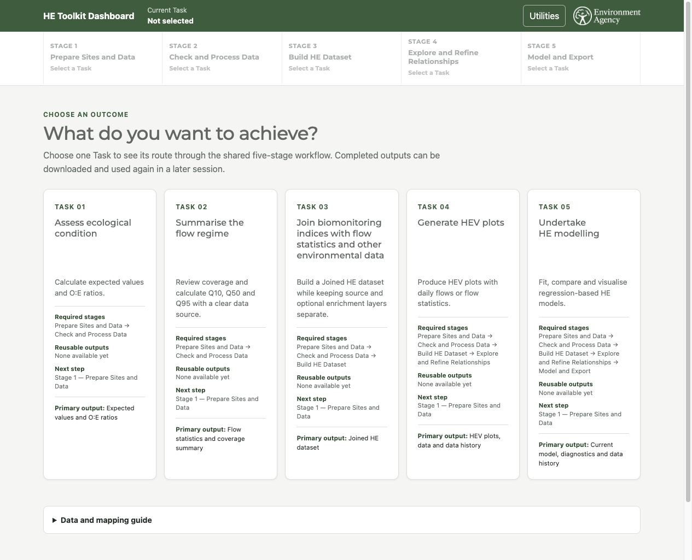

### `ui-parity-02-five-stages.png`

- Commit SHA: `7b200c118d2de7521604a2e0c22ef1cf96aacb1c`
- Scenario: Five-stage path and Core-only scope for Task 5.
- Expected: Five Required Stages; Core-only information when WQ/RHS are not
  selected.
- Actual: PASS. The other four Task paths were also checked through their live
  rendered DOM and are recorded in the path table above.

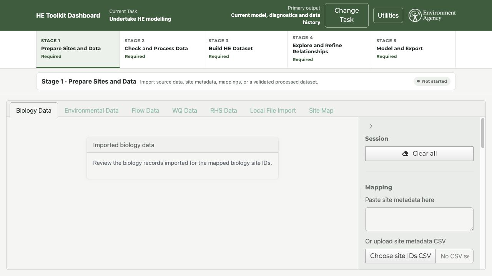

### `ui-parity-03-blocked-checkpoint.png`

- Commit SHA: `7b200c118d2de7521604a2e0c22ef1cf96aacb1c`
- Scenario: Pre-fix baseline — Required Biology and Environmental inputs are
  missing.
- Expected: `Blocked`, a specific blocking reason, and a concrete next action.
- Actual: **BASELINE FAIL**. Superseded by
  `ui-parity-08-blocked-retest.png`.

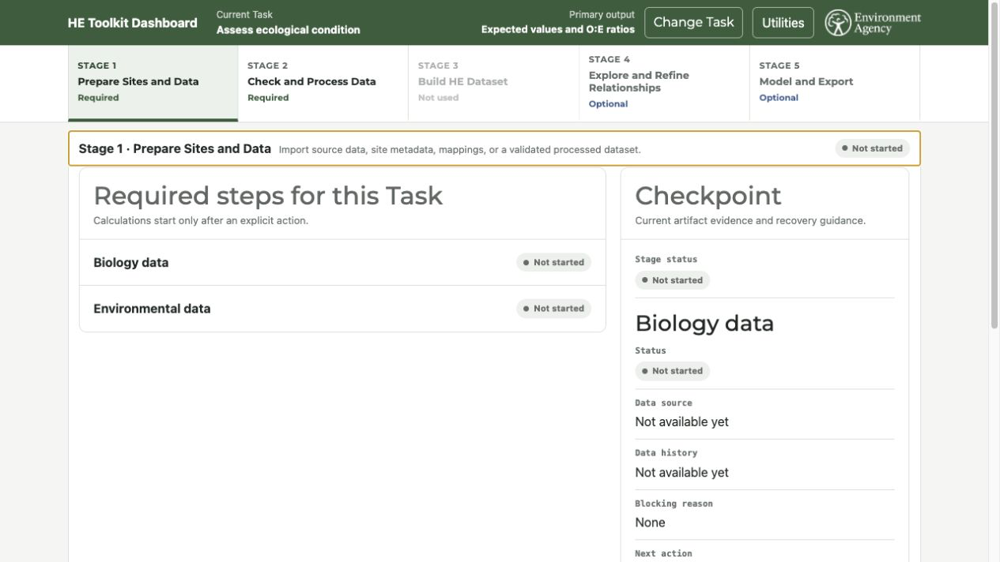

### `ui-parity-04-complete-state.png`

- Commit SHA: `7b200c118d2de7521604a2e0c22ef1cf96aacb1c`
- Scenario: Valid Local Flow upload.
- Expected: Current Flow input and Stage 1 display `Complete`.
- Actual: PASS. Data source is `Local Flow file`; history records the validated
  upload.

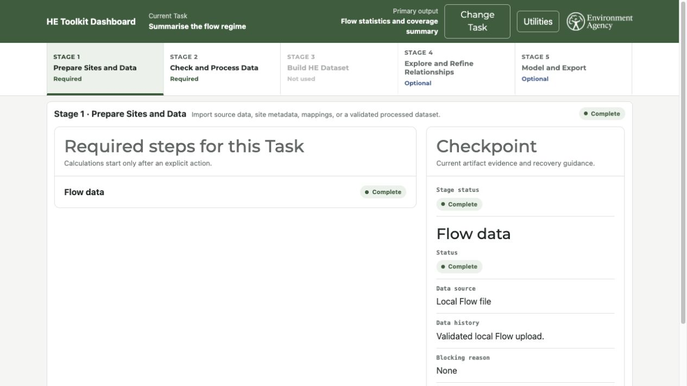

### `ui-parity-05-stale-after-change.png`

- Commit SHA: `7b200c118d2de7521604a2e0c22ef1cf96aacb1c`
- Scenario: Pre-fix baseline — create a downstream Flow-statistics result, then
  change its upstream Flow input.
- Expected: Only dependent results display `Stale`.
- Actual: **BASELINE FAIL / NOT REACHED**. Superseded by
  `ui-parity-09-stale-retest.png`.

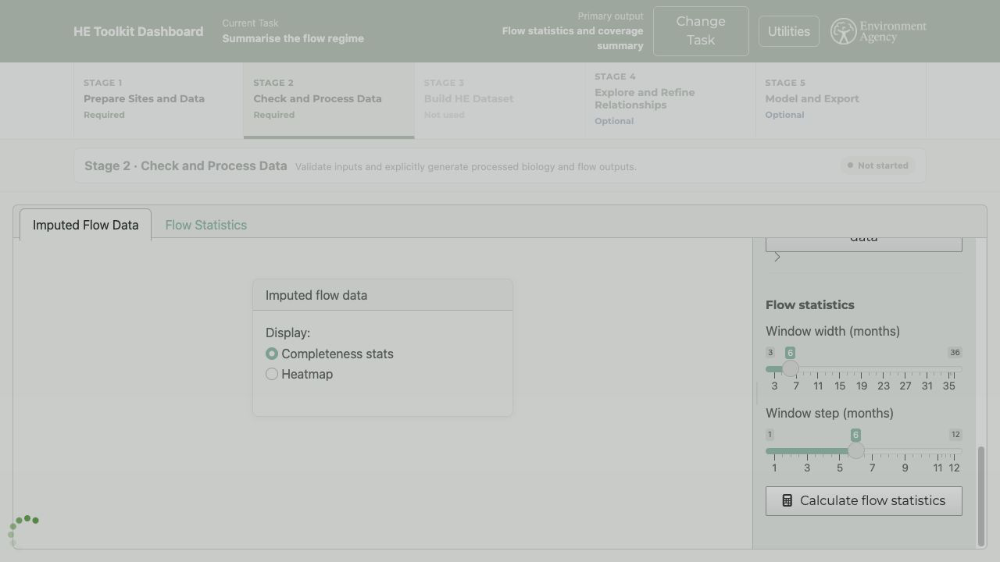

### `ui-parity-06-resume-correct-stage.png`

- Commit SHA: `7b200c118d2de7521604a2e0c22ef1cf96aacb1c`
- Scenario: Select Task 2 after a current Local Flow artifact exists.
- Expected: Resume skips completed Stage 1 and opens Stage 2.
- Actual: PASS. Stage 2 is current and the real Flow workspace is open.

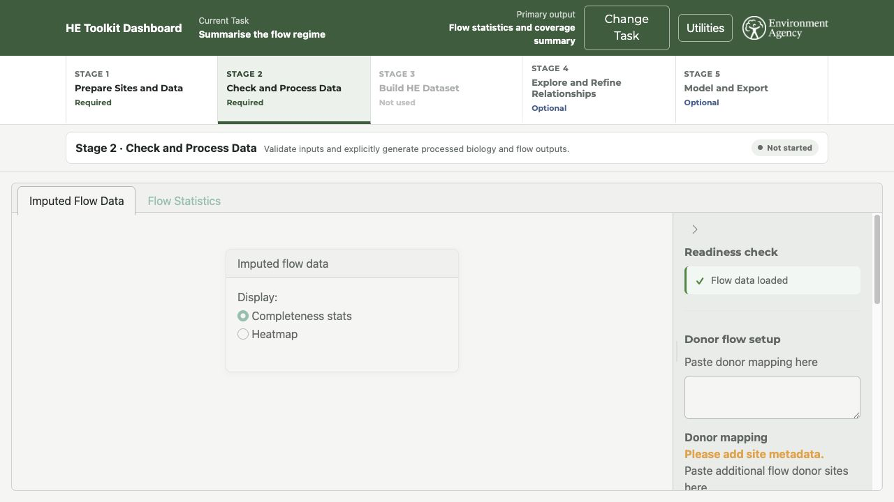

### `ui-parity-07-warning-nonblocking.png`

- Commit SHA: `7b200c118d2de7521604a2e0c22ef1cf96aacb1c`
- Scenario: Upload usable Local Flow data containing extra columns.
- Expected: `Warning` without blocking the usable Flow input.
- Actual: PASS. Stage 1 and Flow input display `Warning`; the file remains the
  current Flow source and the ignored columns are reported.

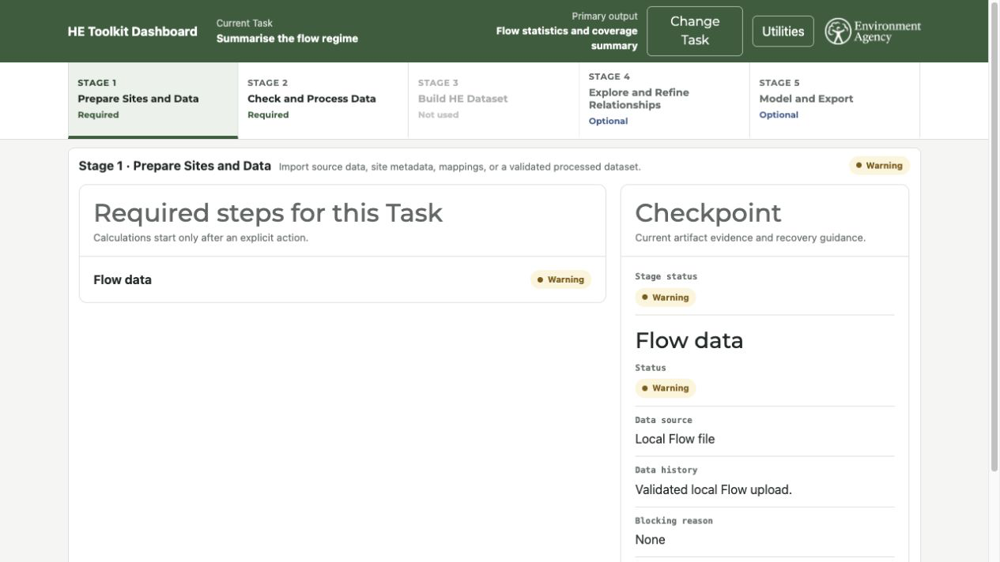

### `ui-parity-08-blocked-retest.png`

- Baseline commit SHA: `7b200c118d2de7521604a2e0c22ef1cf96aacb1c`.
- Implementation diff SHA-256:
  `80abaa681f61edc1619f89887558ca97367f51bb0a3d26e2f2c4837f55b50ad4`.
- Image SHA-256:
  `8b8fd6bd678c561cbaf6e5307a0699b59c483383cf0e57fd504e4f38ff4f9012`.
- Scenario: Click Calculate flow statistics with no current Flow input.
- Expected: `Blocked` plus a concrete recovery action.
- Actual: PASS. Stage 2 displayed `Blocked`; the live announcement instructed
  the user to upload or import Flow data and calculate again.

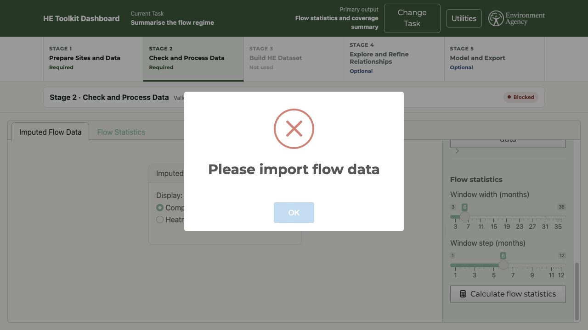

### `ui-parity-09-stale-retest.png`

- Baseline commit SHA: `7b200c118d2de7521604a2e0c22ef1cf96aacb1c`.
- Implementation diff SHA-256:
  `80abaa681f61edc1619f89887558ca97367f51bb0a3d26e2f2c4837f55b50ad4`.
- Image SHA-256:
  `c7a2db32ba1094bad1f426bae4ee66882636248a3cce18d59bf9a54b0bed6904`.
- Scenario: Calculate Flow statistics from a valid 2010–2025 daily Flow source,
  then replace the upstream source with another validated local file.
- Expected: The dependent Flow-statistics result becomes `Stale`.
- Actual: PASS. Stage 2 displayed `Stale` and the live announcement instructed
  the user to regenerate `flow_statistics`.

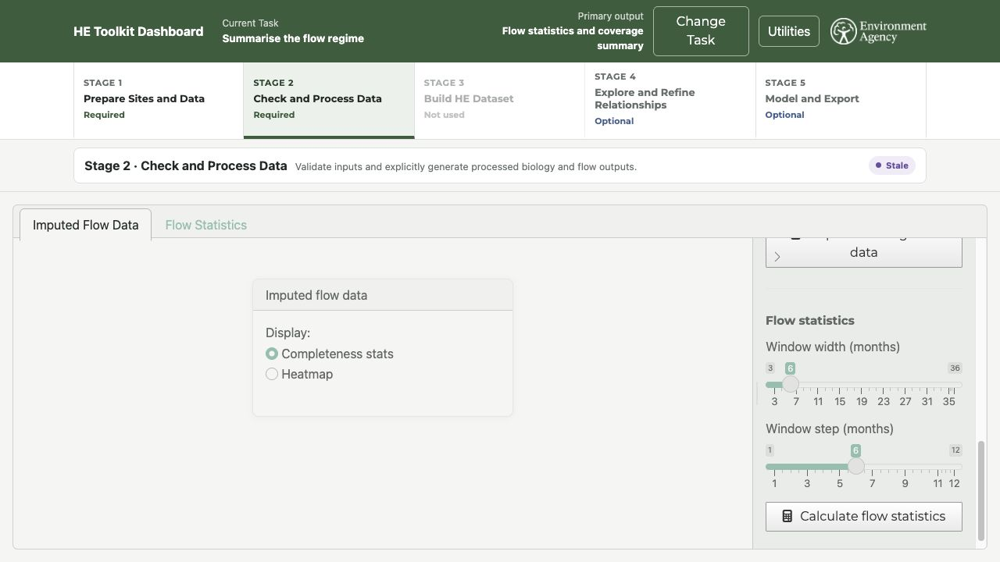

### `ui-parity-10-change-task-reusable.png`

- Baseline commit SHA: `7b200c118d2de7521604a2e0c22ef1cf96aacb1c`.
- Implementation diff SHA-256:
  `80abaa681f61edc1619f89887558ca97367f51bb0a3d26e2f2c4837f55b50ad4`.
- Image SHA-256:
  `8aed40d390a6642bcde9500930d976022f2ed443f72caf55f95bba7f60b19701`.
- Scenario: Complete Flow statistics, then choose Change Task.
- Expected: Reusable completion artifacts remain available.
- Actual: PASS. Task 2 listed `Processed flow, Flow statistics`, displayed
  `Review completed Task`, and offered `Review Stage 2`.

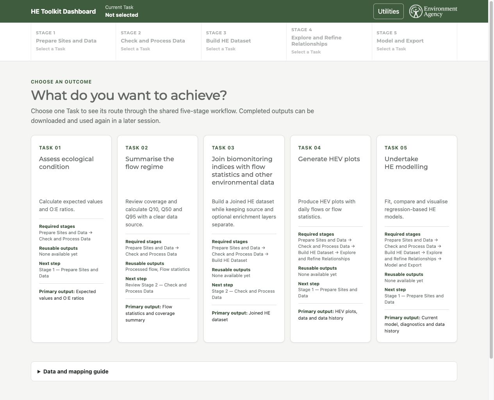

### `ui-parity-11-flowstats-failed-recovery.png`

- Baseline commit SHA: `7b200c118d2de7521604a2e0c22ef1cf96aacb1c`.
- Implementation diff SHA-256:
  `80abaa681f61edc1619f89887558ca97367f51bb0a3d26e2f2c4837f55b50ad4`.
- Image SHA-256:
  `6a48cdbe9f18e700b548eee23f611d38b29878178d8751756c8ce9a3f356c306`.
- Scenario: Run Flow statistics against an insufficient short Flow source.
- Expected: A recoverable workflow failure with a safe reason and retry action;
  no persistent busy overlay.
- Actual: PASS. Stage 2 displayed `Failed`, the notification and live
  announcement provided recovery guidance, and the page returned to its normal
  interactive state.

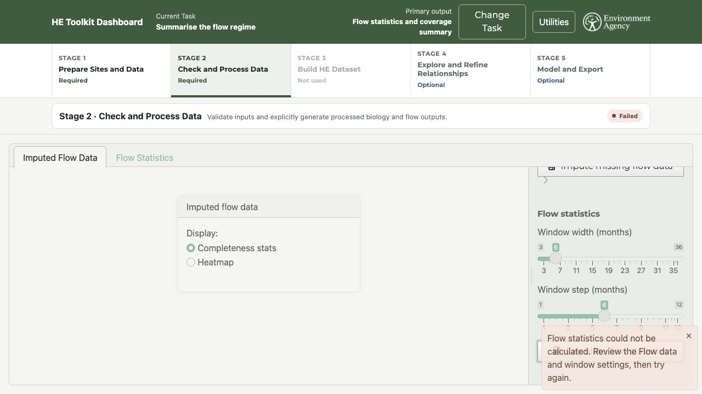

## Follow-up disposition

The three runtime defects recorded in the pre-fix validation are resolved in
this follow-up source state. The complete → upstream change → stale and Change
Task reusable-completion conditions now have independent real-browser evidence.

Bo's formal follow-up approval was subsequently recorded in the controlled
mapping. The mapping status is `FROZEN`.
